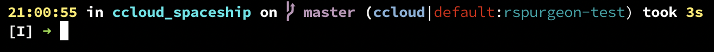

# Confluent Cloud Spaceship prompt section
If you're a user of [Confluent Cloud](cloud.confluent.io) and the [Spaceship Prompt](https://denysdovhan.com/spaceship-prompt/), this will display Confluent Cloud status on your prompt integrated w/ the rest of spaceship

# usage
* Clone locally
* Create a symlink to `<repo>/ccloud.zsh` in `<oh-my-zsh dir>/custom/themes/spaceship-prompt/sections`
* Override `SPACESHIP_PROMPT_ORDER` variable to include ccloud, for example:
  ```
  SPACESHIP_PROMPT_ORDER=(
    time          # Time stampts section
    user          # Username section
    host          # Hostname section
    dir           # Current directory section
    git           # Git section (git_branch + git_status)
    package       # Package version
    ruby          # Ruby section
    golang        # Go section
    docker        # Docker section
    aws           # Amazon Web Services section
    venv          # virtualenv section
    pyenv         # Pyenv section
    kubecontext   # Kubectl context section
    ccloud        # Confluent cloud section
    exec_time     # Execution time
    line_sep      # Line break
    battery       # Battery level and status
    vi_mode       # Vi-mode indicator
    jobs          # Backgound jobs indicator
    exit_code     # Exit code section
    char          # Prompt character
  )
* Enable various Spaceship prompt features, including `ccloud`
	```
	ZSH_THEME="spaceship"
	SPACESHIP_TIME_SHOW=true
	SPACESHIP_TIME_PREFIX=
	SPACESHIP_CCLOUD_SHOW=true
	SPACESHIP_CCLOUD_PREFIX=
	SPACESHIP_KUBECONTEXT_SHOW=false
	SPACESHIP_DOCKER_SHOW=false
	SPACESHIP_NODE_SHOW=false
	SPACESHIP_PACKAGE_SHOW=false
	```

  ``` 
* Customize:
	```
	SPACESHIP_CCLOUD_SHOW=true|false
	SPACESHIP_CCLOUD_PREFIX
	SPACESHIP_CCLOUD_SUFFIX
	```

Example:

